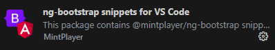

# @mintplayer/ng-bootstrap
# Demo
A complete demo application with all components is showcased [here](https://bootstrap.mintplayer.com)

## Version info

| License      | Build status | Code coverage |
|--------------|--------------|---------------|
|  |  |  |

| Package                      | Version |
|------------------------------|---------|
| @mintplayer/ng-animations    |  |
| @mintplayer/ng-click-outside |  |
| @mintplayer/ng-focus-on-load |  |
| @mintplayer/ng-bootstrap     |  |
| @mintplayer/ng-qr-code     |  |

## Installation

    npm i @mintplayer/ng-bootstrap

This should also install the peerDependencies in your project.

Now you should import the `bootstrap` stylesheet in the application. To do so, you have 2 options:

Update your `angular.json`:

    "styles": [
      "@mintplayer/ng-bootstrap/bootstrap.scss",
      "src/styles.scss"
    ],

Or add the stylesheet in your `styles.scss`

    @import '@mintplayer/ng-bootstrap/bootstrap.scss';

## Components
All components are showcased in the angular app included in the project. You can simply run

    npm start -- --open

to discover them.

## Fonts
The `<bs-icon>` uses fonts from bootstrap-icons which need to be included in the application. Since there's no `"assets"` field in an angular library its project configuration, we seem to have no other option than to explicitly tell the application to include them.

`angular.json` / `project.json`

    {
      "projects": {
        ...,
        "xxx": {
          ...,
          "architect": {
            "build": {
              "options": {
                ...,
                "assets": [
                  ...,
                  {
                    "glob": "*.woff|*.woff2",
                    "input": "node_modules/bootstrap-icons/font/fonts",
                    "output": "/fonts"
                  }
                ]
              }
            }
          }
        }
      }
    }

## VS Code snippets
This workspace contains several code snippets for [VS Code](https://code.visualstudio.com).
They are distributed on the [MarketPlace](https://marketplace.visualstudio.com/items?itemName=MintPlayer.mintplayer-ng-bootstrap-snippets) and can be installed by searching for **ng-bootstrap snippets for VS Code**

## Discover yourself
Make sure you have [NodeJS](https://nodejs.org/en/download/) installed.
Then run following commands

    git clone https://github.com/MintPlayer/mintplayer-ng-bootstrap
    npm i
    npm start -- --open

## Features
- Uses `@angular/cdk/overlay`
- Uses per-component styles. Only non-generic bootstrap styles are bundled in the main bundle
- Carousel: supports touch-events
- Noscript support for **Navbar** and **Carousel**, requires `@angular/universal`
