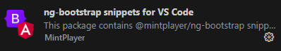

# @mintplayer/ng-bootstrap
# Demo
A complete demo application with all components is showcased [here](https://bootstrap.mintplayer.com)

## Version info

| License      | Build status | Code coverage |
|--------------|--------------|---------------|
|  |  |  |

| Package                      | Version |
|------------------------------|---------|
| @mintplayer/ng-animations    |  |
| @mintplayer/ng-click-outside |  |
| @mintplayer/ng-focus-on-load |  |
| @mintplayer/ng-bootstrap     |  |
| @mintplayer/ng-qr-code     |  |

## Installation

    npm i @mintplayer/ng-bootstrap

This should also install the peerDependencies in your project.

Now you should import the `bootstrap` stylesheet in the application. To do so, you have 2 options:

Update your `angular.json`:

    "styles": [
      "@mintplayer/ng-bootstrap/bootstrap.scss",
      "src/styles.scss"
    ],

Or add the stylesheet in your `styles.scss`

    @import '@mintplayer/ng-bootstrap/bootstrap.scss';

## Components
Every web component is showcased in three sibling demo apps — one per
framework — so you can pick the wrapper layer that matches your stack.
They render the **same** underlying `<mp-*>` / `<mint-*>` web component;
only the wrapper API differs.

### Run locally via the Nx dev server

| Framework | Lib | Dev server | Command |
|---|---|---|---|
| Angular  | `@mintplayer/ng-bootstrap`     | <http://localhost:4200> | `npx nx serve ng-bootstrap-demo` |
| React 19 | `@mintplayer/react-bootstrap`  | <http://localhost:4000> | `npx nx serve react-bootstrap-demo` |
| Vue 3.5  | `@mintplayer/vue-bootstrap`    | <http://localhost:4100> | `npx nx serve vue-bootstrap-demo` |

All three can run simultaneously — the ports don't collide. The
brand-mark links in each demo's top-right nav switch between them while
preserving the current path.

The shorter `npm start -- --open` is wired to the Angular demo by
default (see `scripts.start` in `package.json`).

### Run via the published Docker images

Pre-built images are published to GitHub Container Registry on every
push to `master`. They serve the production build through nginx
(SPA-fallback configured for client-side routing).

    # Angular demo
    docker run -p 4200:80 ghcr.io/mintplayer/mintplayer-ng-bootstrap:master

    # React demo
    docker run -p 4000:80 ghcr.io/mintplayer/mintplayer-ng-bootstrap-react-demo:master

    # Vue demo
    docker run -p 4100:80 ghcr.io/mintplayer/mintplayer-ng-bootstrap-vue-demo:master

Then visit <http://localhost:4200>, <http://localhost:4000>, or
<http://localhost:4100> respectively.

### Hosted versions

| Framework | URL |
|---|---|
| Angular | <https://bootstrap.mintplayer.com> |
| React   | <https://react.bootstrap.mintplayer.com> |
| Vue     | <https://vue.bootstrap.mintplayer.com> |

## Deployment
See [deployment documentation](DEPLOYMENT.md) for instructions on setting up automatic deployment to a VPS.

## Fonts
The `<bs-icon>` uses fonts from bootstrap-icons which need to be included in the application. Since there's no `"assets"` field in an angular library its project configuration, we seem to have no other option than to explicitly tell the application to include them.

`angular.json` / `project.json`

    {
      "projects": {
        ...,
        "xxx": {
          ...,
          "architect": {
            "build": {
              "options": {
                ...,
                "assets": [
                  ...,
                  {
                    "glob": "*.woff|*.woff2",
                    "input": "node_modules/bootstrap-icons/font/fonts",
                    "output": "/fonts"
                  }
                ]
              }
            }
          }
        }
      }
    }

## VS Code snippets
This workspace contains several code snippets for [VS Code](https://code.visualstudio.com).
They are distributed on the [MarketPlace](https://marketplace.visualstudio.com/items?itemName=MintPlayer.mintplayer-ng-bootstrap-snippets) and can be installed by searching for **ng-bootstrap snippets for VS Code**

## Discover yourself
Make sure you have [NodeJS](https://nodejs.org/en/download/) installed.
Then run following commands

    git clone https://github.com/MintPlayer/mintplayer-ng-bootstrap
    npm i
    npm start -- --open

## Features
- Uses `@angular/cdk/overlay`
- Uses per-component styles. Only non-generic bootstrap styles are bundled in the main bundle
- Carousel: supports touch-events
- Noscript support for **Navbar** and **Carousel**, requires `@angular/universal`
