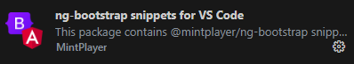

# @mintplayer/ng-bootstrap
# Demo
A complete demo application with all components is showcased [here](https://bootstrap.mintplayer.com)

## Version info

| License      | Build status | Code coverage |
|--------------|--------------|---------------|
| [](https://opensource.org/licenses/Apache-2.0) | [](https://github.com/MintPlayer/mintplayer-ng-bootstrap/actions/workflows/publish-master.yml) | [](https://coverage.mintplayer.com/r/MintPlayer/mintplayer-ng-bootstrap) |


| Package                      | Version |
|------------------------------|---------|
| @mintplayer/ng-animations    | [](https://badge.fury.io/js/%40mintplayer%2Fng-animations) |
| @mintplayer/ng-click-outside | [](https://badge.fury.io/js/%40mintplayer%2Fng-click-outside) |
| @mintplayer/ng-focus-on-load | [](https://badge.fury.io/js/%40mintplayer%2Fng-focus-on-load) |
| @mintplayer/ng-bootstrap     | [](https://badge.fury.io/js/%40mintplayer%2Fng-bootstrap) |
| @mintplayer/ng-qr-code     | [](https://badge.fury.io/js/%40mintplayer%2Fng-qr-code) |

## Installation

    npm i @mintplayer/ng-bootstrap

This should also install the peerDependencies in your project.

Now you should import the `bootstrap` stylesheet in the application. To do so, you have 2 options:

Update your `angular.json`:

    "styles": [
      "@mintplayer/ng-bootstrap/bootstrap.scss",
      "src/styles.scss"
    ],

Or add the stylesheet in your `styles.scss`

    @import '@mintplayer/ng-bootstrap/bootstrap.scss';

## Components
Every web component is showcased in three sibling demo apps — one per framework — so you can pick the wrapper layer that matches your stack. They render the **same** underlying `<mp-*>` / `<mint-*>` web component; only the wrapper API differs.

### Run locally via the Nx dev server

| Framework | Lib                            | Dev server              | Command                            |
|-----------|--------------------------------|-------------------------|------------------------------------|
| Angular   | `@mintplayer/ng-bootstrap`     | <http://localhost:4200> | `npx nx serve ng-bootstrap-demo`    |
| React 19  | `@mintplayer/react-bootstrap`  | <http://localhost:4000> | `npx nx serve react-bootstrap-demo` |
| Vue 3.5   | `@mintplayer/vue-bootstrap`    | <http://localhost:4100> | `npx nx serve vue-bootstrap-demo`   |

All three can run simultaneously — the ports don't collide. The brand-mark links in each demo's top-right nav switch between them while preserving the current path.

To boot **all three demos + the .NET API at once** from a single terminal (one `dotnet watch` shared by all three; one Ctrl+C tears the whole tree down):

    npx nx run-many -t serve -p 'ng-bootstrap-demo,react-bootstrap-demo,vue-bootstrap-demo'

The single quotes around the project list are required on PowerShell — without them, `-p a,b,c` is parsed as PowerShell's comma-operator array and split into separate args, which Nx silently rejects with "No tasks were run".

Each demo's `serve` target lists the API serve as a dependency and is flagged `continuous: true`, so Nx folds the task graph into a single `api:serve` invocation instead of racing three of them for the same `bin/Debug/net10.0/` DLL locks.

The shorter `npm start -- --open` is wired to the Angular demo by default (see `scripts.start` in `package.json`).

## Styling and encapsulation

Components come in two tiers. Which tier a component is in decides whether your stylesheets reach
inside it, and it is decided by one question: **does the component mount DOM that you authored?**

### Shadow tier — the default

Around thirty components keep a shadow root and take your content through native `<slot>`s: card,
accordion, carousel, tab-control, navbar, shell, splitter, dock and the rest. Slotted content never
leaves your document, so your stylesheets, your framework's component CSS and Bootstrap's utility
classes all reach it exactly as they would anywhere else. The component's own internals are isolated
by the browser; where a component wants to expose one, it does so through `::part()`.

### Light tier — components that mount your DOM

`<mp-datatable>`, `<mp-treeview>`, `<mp-tree-select>` and the `<mp-query-builder>` family accept
render callbacks — a row template, a node template, a cell renderer, an editor factory — and mount
the DOM you return **inside themselves**. A shadow root would starve that content: document
stylesheets do not cross the boundary, so your own component's CSS and every Bootstrap utility would
be inert on markup you wrote (issue #408).

These components therefore render in the **light DOM**, and their own styles are scoped at build
time onto a `data-mps` attribute instead — the same device Angular's `ViewEncapsulation.Emulated`
uses for `_ngcontent`. Two consequences follow, and they are the whole trade:

- **Your CSS reaches your content, normally.** Nothing to configure, nothing to transport. A
  `<span class="badge bg-success">` in a datatable row is styled by the Bootstrap you already load.
- **Page CSS also reaches the component's internals.** A global `td { padding: 0 }` in your
  stylesheet will affect these components. This is the identical property emulated encapsulation has
  everywhere else in your app; it is supported and deliberate, not a defect.

The component's own styles still cannot leak **out** onto your markup: every rule is anchored to an
element the build stamped, and two conformance suites enforce it on every build — one proving no
rule matches unstamped markup, one proving no rule matches DOM you hand in through a callback.

### Migrating to the light tier

If you use any of the four components above, check for these. Everything else is unchanged.

| What changes | What to do |
|---|---|
| `::part()` and `::slotted()` no longer address these components | Use ordinary CSS selectors — they now reach descendants `::part()` never could |
| The `<mp-query-builder>` family's `part=` attributes are removed | As above; nothing in the demos consumed them |
| `datatableStyles` / `treeviewStyles` / `treeSelectStyles` exports | Renamed to `datatableLightStyles` / `treeviewLightStyles` / `treeSelectLightStyles` |
| `el.shadowRoot` in your own code or tests | Use `el.renderRoot`, or `el.shadowRoot ?? el` |
| Focus assertions against a shadow root | `document.activeElement` is now the real element, not the retargeted host |
| A page stylesheet that broadly styles `table`, `td`, `li` or `input` | It now applies inside these components too — scope it, or override with the component's own custom properties |

If you host one of these components **inside your own shadow root**, adopt their sheets into it or
they render unstyled — the same boundary problem, one level up:

```ts
import { adoptLightStyles } from '@mintplayer/web-components/light-dom';

connectedCallback() {
  super.connectedCallback();
  this.releaseStyles = adoptLightStyles(this.shadowRoot);
}
disconnectedCallback() {
  this.releaseStyles?.();
  super.disconnectedCallback();
}
```

Server-rendered pages get the same sheets injected into `<head>` by `injectMpLightStyles` from
`@mintplayer/web-components/light-dom/ssr`, so the light tier is styled with JavaScript disabled.
The demo's `server.ts` shows it composed with the Declarative Shadow DOM injectors.

## Docker image
Alternatively you can run the docker image which is published on GitHub Container Registry

    docker run -p 4200:80 ghcr.io/mintplayer/mintplayer-ng-bootstrap:master

and visit [http://localhost:4200](http://localhost:4200).

## Deployment
See [deployment documentation](DEPLOYMENT.md) for instructions on setting up automatic deployment to a VPS.

### SSR behind a reverse proxy (Angular)

All three demos are deployed with **request-time SSR** so the `<mp-shell>` Declarative Shadow DOM is in the HTML and the layout renders with JavaScript disabled. The Angular SSR server has two `@angular/ssr` security guards that must be configured for the public domain, or it silently falls back to **client-side rendering** (you get an HTTP `200` with an empty `<demo-bootstrap-root></demo-bootstrap-root>` shell — no server-rendered content, no DSD):

1. **`NG_ALLOWED_HOSTS`** — the Host-header SSRF allow-list. Must contain the public domain (e.g. `bootstrap.mintplayer.com`). A *mismatch* here returns a hard `400`; an *empty* list falls back to CSR.
2. **`NG_TRUST_PROXY_HEADERS`** — the list of `x-forwarded-*` headers to trust. **This is the one that bit us in production.** `@angular/ssr` deopts to CSR for *any* incoming `x-forwarded-*` header it doesn't trust, and its default trusted set is only `x-forwarded-host` + `x-forwarded-proto`. Traefik also forwards `x-forwarded-for`, `x-forwarded-port`, and `x-forwarded-server`, so every proxied request silently deopted to CSR until these were trusted.

Both are set on the `ng-bootstrap` service in [`docker-compose.yml`](docker-compose.yml):

```yaml
environment:
  - "NG_ALLOWED_HOSTS=bootstrap.mintplayer.com"
  - "NG_TRUST_PROXY_HEADERS=x-forwarded-host,x-forwarded-proto,x-forwarded-for,x-forwarded-port,x-forwarded-prefix,x-forwarded-server"
```

Gotchas:

- **`NG_TRUST_PROXY_HEADERS=true` does not work.** The env value is comma-split into a list of header names, so `true` is read as a header literally named `true`. List the headers explicitly.
- **The React/Vue demos are unaffected** — their plain Express SSR servers have no host/proxy-header validation, which is why they kept rendering correctly while Angular did not.
- **Local `nx serve` / `node server.mjs` without a proxy works regardless**, because no `x-forwarded-*` headers are present — the deopt only manifests once a reverse proxy sits in front. To reproduce, replay the proxy headers against a production build:

  ```bash
  curl -s -o out.html -H "Host: bootstrap.mintplayer.com" \
    -H "X-Forwarded-Host: bootstrap.mintplayer.com" -H "X-Forwarded-Proto: https" \
    -H "X-Forwarded-For: 203.0.113.7" -H "X-Forwarded-Port: 443" \
    http://localhost:4000/overlays/shell
  # without NG_TRUST_PROXY_HEADERS → ~6.5 KB CSR shell; with it → full SSR + <template shadowrootmode>
  ```

## Fonts
The `<bs-icon>` uses fonts from bootstrap-icons which need to be included in the application. Since there's no `"assets"` field in an angular library its project configuration, we seem to have no other option than to explicitly tell the application to include them.

`angular.json` / `project.json`

    {
      "projects": {
        ...,
        "xxx": {
          ...,
          "architect": {
            "build": {
              "options": {
                ...,
                "assets": [
                  ...,
                  {
                    "glob": "*.woff|*.woff2",
                    "input": "node_modules/bootstrap-icons/font/fonts",
                    "output": "/fonts"
                  }
                ]
              }
            }
          }
        }
      }
    }

## VS Code snippets
This workspace contains several code snippets for [VS Code](https://code.visualstudio.com).
They are distributed on the [MarketPlace](https://marketplace.visualstudio.com/items?itemName=MintPlayer.mintplayer-ng-bootstrap-snippets) and can be installed by searching for **ng-bootstrap snippets for VS Code**

[](libs/mintplayer-ng-bootstrap-snippets/images/marketplace.png)

## Discover yourself
Make sure you have [NodeJS](https://nodejs.org/en/download/) installed.
Then run following commands

    git clone https://github.com/MintPlayer/mintplayer-ng-bootstrap
    npm i
    npm start -- --open

## Features
- Uses `@angular/cdk/overlay`
- Uses per-component styles. Only non-generic bootstrap styles are bundled in the main bundle
- Framework-agnostic web components (`@mintplayer/web-components`) with Angular, React and Vue wrappers
- Carousel: touch-events, keyboard navigation, full APG carousel ARIA
- Charts with **zero runtime dependencies**, under a nested `charts/*` subpath per framework (e.g. `@mintplayer/ng-bootstrap/charts/hierarchy`): a hierarchy chart with three interchangeable layouts (`sunburst` / `icicle` / `treemap`, drill-down and unbounded `max-depth="auto"`), a trend chart and a sparkline. Keyboard-operable and screen-reader navigable via the ARIA *tree* pattern
- Interactive no-JS support for **Navbar**, **Shell**, **Dropdown menu** and **Carousel** on server-rendered pages (Declarative Shadow DOM + pure-CSS state machines) — works in all three framework demos
